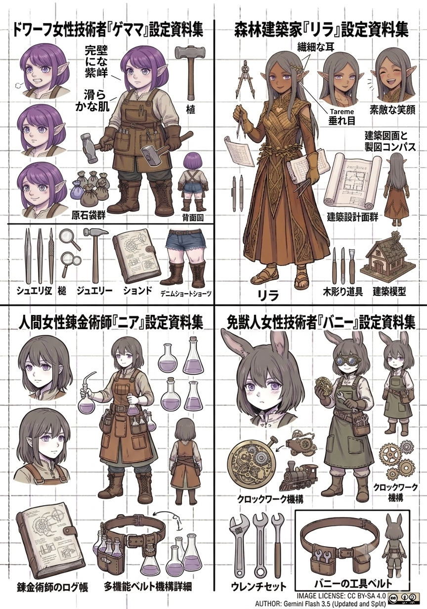
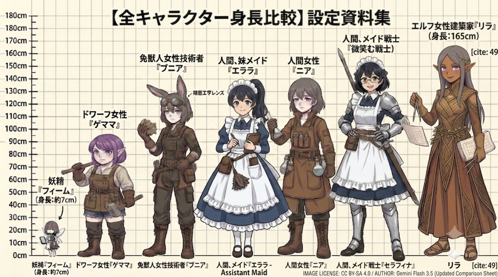
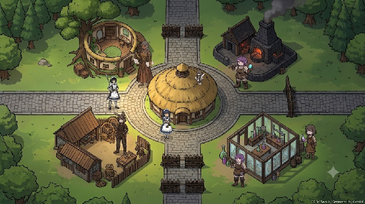
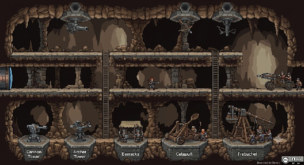
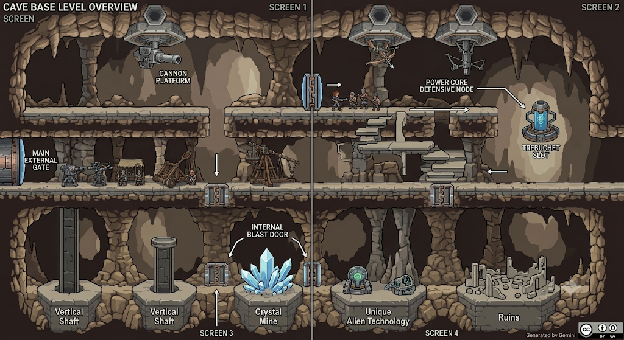
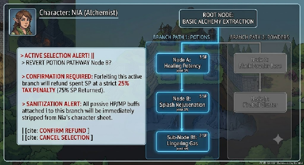

# **Game Design Document: Side-Scrolling Tower Defense (Project TDSS)**

**Document Path:** projects/TDSS/docs/game_design_document.md  
**Status:** Core Architecture & Concept Specification

## **Executive Summary & Core Pillars**

**Side-Scrolling Tower Defense (TDSS)** is a genre-blending strategy game that marries top-down/isometric base management with side-scrolling, multi-tiered tactical combat. Players manage a single expanding village hub that branches into a vast, interconnected network of active defensive fronts.

### **Core Pillars**

- **The Connected Front (Live RTS World):** Combat zones are not isolated levels; they are physical extensions of the village paths. Defenses built on prior stages remain active and can be attacked simultaneously if the enemy breaks through structural lines.
- **Hardcore Engineering Stakes:** Your infrastructure depends entirely on a specialized support team. If any specialist dies, the project fails permanently.
- **Hybrid Dimensional Combat:** Transitioning seamlessly from strategic top-down structural upgrades to deep, side-scrolling physical layouts featuring complex vertical topography (caves, hills, and multi-tier platforms).

## **World Layout & Navigation**

The game splits its perspective between the peaceful development of the hub and the high-stakes execution of field defense.

### **The Main Village Hub (Top-Down / Isometric)**

- **Structure:** The central hub features the primary base building (starting as a primitive hut and evolving into a fortified stone keep) surrounded by four primary exits aligned to the cardinal directions: **North, East, South, and West**.
- **Specialist Quarters:** Dedicated workspaces for the Architect, Engineer, Blacksmith, and Alchemist populate the village grounds. These spaces visually upgrade from crude workshops to state-of-the-art labs as the specialists level up.

### **The Overworld Movement Map**

- **Layout:** Modeled after classic global progression maps (e.g., _Super Mario_ world maps). The game world is a continuous, stretching road network mapped entirely along the N, E, S, and W axes.
- **Real-Time Backtracking:** To progress, the player must physically walk, run, or teleport along these roads. For example, if you are defending a checkpoint 3 screens deep to the North, but your established frontline 6 screens deep to the West flashes an alert, you must physically travel back across the paths to handle the crisis.

### **Side-Scrolling Defense Zones**

When entering an active path checkpoint, the view transitions into a side-scroller.

- **Scale:** Standard encounter maps span **2 to 3 screens wide**, allowing players to scout ahead, fortify layouts, and fall back if a position is overrun.
- **Topography & Verticality:** Maps feature complex layers mimicking classic tactical platformers (_Abuse, Super Metroids, Lemmings, Prince of Persia_). Levels include:
    - _Deep Caves:_ Distinct upper and lower subterranean pathways requiring separate defensive clusters.
    - _High Ridges:_ Natural hills requiring players to climb heights to construct dedicated anti-air batteries against descending enemy gunships.

## **Character Roster & Development**

Progression splits into two categories: the Player Character (Hero/Heroine) who scales in raw combat power, and the Support Staff whose growth unlocks the structural tech tree.

  


### **The Support Specialists**

These four characters drive all resource refinement and structural development. They do not participate directly in the vanguard but are highly vulnerable during construction windows.  


| Character Name       | Role                      | Height Reference   | Primary Inventions / Responsibilities                                                                                                                                |
| :------------------- | :------------------------ | :----------------- | :------------------------------------------------------------------------------------------------------------------------------------------------------------------- |
| **Lila (リラ)**      | Forest Architect          | 165cm              | Building blueprints, structural upgrades, camp expansions, and layout designs using woodcarving tools.                                                               |
| **Gemama (ゲママ)**  | Metallurgist / Blacksmith | \~95cm (Dwarf)     | Raw gemstone refining, heavy metal forging, basic machinery framing, and armor plating.                                                                              |
| **Bunnira (バニラ)** | Clockwork Engineer        | \~125cm (Beastkin) | Clockwork automation, gear systems, heavy tactical weaponry (Catapults, Trebuchets, Tanks).                                                                          |
| **Nia (ニア)**       | Human Alchemist           | \~140cm            | Chemical blending, explosive components (Gunpowder), and combat potions. _(Note: Actively serves as the sole source of healing since standard medics do not exist)._ |

### **Supporting Cast & Hub Personnel**

- **Elara (エララ):** Assistant Maid (Human, \~140cm) who coordinates domestic logistics and workshop upkeep within the village.
- **Serafina (セラフィナ):** Maid Warrior (Human, \~155cm) who serves as a specialized domestic combatant, protecting the perimeter of the village workshops.
- **Fheem (フィーム):** A tiny fairy (\~7cm) accompanied by two persistent twin avatars—a miniature angel on one shoulder and a devil on the other. She serves as the player's core magical interface and guide.

Here is the clean, un-truncated, full text designed to be copied and pasted directly into your Google Doc as Section 4\. It maintains your character names, image tag structures, and format flow perfectly.

## **RPG Attribute Engine & Leveling Ceilings**

All active entities—including the primary hero, support specialists, domestic staff, and deployed defense assets—operate under a standardized RPG ruleset. Leveling metrics differentiate organic characters from manufactured defenses.

### **Core Attributes Matrix**

- **Health Points (HP):** Baseline structural or biological integrity. If a Support Specialist drops to 0 HP, permadeath triggers, resulting in an immediate Game Over.
- **Mana or Magic Points (MP):** Expended to activate specialized spells, tactical barriers, or high-tier transmutations.
- **Stamina (STA):** Manages mechanical execution or biological exertion thresholds (sprinting, working, active manual repairs).
    - _Mechanical Exemption:_ Deployed defense towers and mobile clockwork machinery (Catapults, Trebuchets, Tanks) **do not possess Stamina (STA)** and function indefinitely at optimal capacity.
- **Automatic Growth:** Levels are achieved automatically as an entity's Experience Point (ExP) gauge hits its specified ceiling. Each successive Level increases the overall ExP ceiling geometrically, steepening the leveling progression curve. Upon crossing an ExP ceiling, metrics such as HP, MP, and INT scale upward automatically.
- **ExP Multipliers:** Specific high-tier modifiers or strategic gacha rewards grant temporary **x10 ExP buffs**, accelerating level growth windows.

###

### **Master Entity Attribute & Currency Matrix**

###

###

| Stat / Attribute               | Target Entities                     | Core Mechanics & Tactical Constraints                                                                                                                                                                                                                                                                            |
| :----------------------------- | :---------------------------------- | :--------------------------------------------------------------------------------------------------------------------------------------------------------------------------------------------------------------------------------------------------------------------------------------------------------------- |
| **HP** _(Health Points)_       | All Entities (Organic & Mechanical) | Represents physical or structural lifecycle integrity. If a Support Specialist drops to 0 HP, permadeath triggers an immediate Game Over. Auto-scales upward upon character level-up.                                                                                                                            |
| **MP** _(Mana / Magic Points)_ | Organic Characters & Magical Units  | The tactical fuel tank consumed to cast active spells, trigger high-tier engineering transmutations, project energy barriers, or activate alchemical formulas. Auto-scales upward upon character level-up.                                                                                                       |
| **STA** _(Stamina)_            | Organic Characters Only             | Manages the physical exertion threshold for movement, sprinting, and real-time structural repair windows. Deployed defense towers and mobile clockwork machinery (Catapults, Tanks) **do not possess Stamina** and are entirely exempt from exhaustion.                                                          |
| **INT** _(Intelligence)_       | Organic Characters                  | A core mental attribute that auto-scales upward upon leveling up. Dictates the underlying effectiveness, potency, and capability caps of magical, engineering, and alchemical tech tree nodes.                                                                                                                   |
| **ExP** _(Experience Points)_  | All Entities (Shared Pool)          | Accumulated collectively during field combat (+1 per tower kill, \+100 per scenario clear) into an inverted global pool. Once an entity's custom geometric ceiling is met, they level up automatically. Can be accelerated by x10 ExP modifiers and is distributed manually by the player in the overworld menu. |
| **SP** _(Skill Points)_        | Organic Characters                  | A permanent progression currency awarded upon hitting character level-up milestones. SP is spent manually like cash to purchase individual nodes across branching tech trees during pre-level assembly windows. Refunding nodes carries a 25% tax penalty.                                                       |

## **Inverted Global Group ExP Pool**

Field combat rewards strategy rather than individual final-hit tallies by leveraging a pooled distribution model.

### **The Pool Mechanics**

When tactical encounters occur, ExP is generated collectively. If a side-scrolling map session contains 10 active combat elements (e.g., the Player, 4 Support units, 2 Maids, 1 Fairy, and 2 Towers), the gained experience is not linearly split 10 ways. It follows an asymmetric gathering mechanic:

- **Direct Gain Constraints:** An operational Tower or Catapult gains \+1 ExP per direct target neutralized. Back-line non-combatants or specialists stationed away from danger gain 0 ExP directly from active field kills.
- **Scenario Completion Clear:** Successfully holding a front or completing a map yields a massive global lump sum (e.g., \+100 ExP) into the shared account.

### **Manual Distribution Protocol**

The total consolidated sum of collected ExP is handed over to the player during the overworld strategic management phase. The player is granted absolute authority to allocate the pool down to the individual digit:

- **Combat Focus:** Funnel the entire session's accumulated ExP straight into operational frontline towers to rapidly boost their firing speeds and baseline HP.
- **Infrastructure Focus:** Channel 100% of the map's total ExP into the Forest Architect (Lila) so she can clear structural level barriers and unlock new facility layouts.

## **Interactive Skill-Trees & Reset Protections**

While base attribute points scale entirely via automated level milestones, tactical maneuvers, compound formulas, and defensive blueprinted systems require explicit human assignment via Skill Trees.

### **Human Interaction Parameters**

- **Skill Points (SP):** Earned upon leveling up. SP serves as a distinct resource spent to navigate and buy nodes within character progression trees.
- **Modification Windows:** Tree adjustment is restricted to the pre-level setup interface at the absolute start of a scenario map. Once a node is purchased, the character is locked to that branch path for the duration of the match.
- **Branch Reversion & Retraction:** Players can manually dissolve active nodes starting from the tip down to a specified reversion node to unlock a different branch structure.
    - _The Respec Tax:_ Dissolving chosen nodes refunds the spent SP but applies a strict **25% tax penalty (the player recovers a 75% refund)** on all investments along the terminated branch.
    - _Anti-Exploit Buff Sanitization:_ When a player rolls back a branch, a thorough rollback protocol sanitizes the character sheet. All physical attribute increases (such as permanent HP, MP, or status bonuses built into high-cost node properties) are cleanly stripped instantly. This prevents structural exploits where a player could buy a high-cost node for the stat boost and then attempt to migrate the metrics over to an alternate path.
- **Node Pricing Hierarchy:** Progression trees feature tiered point allocations balancing mechanical scale against utility. For instance, a basic node may cost 3 SP, while an adjacent elite sibling costs 5 SP but unlocks a vastly more powerful trait. If a player holds 10 SP, they can buy the 5 SP node, the 3 SP sibling, and a subsequent 2 SP sub-node. If they roll back the elite path, the 25% penalty accurately processes against the 5 SP base.

### **Specialist Tech Tree Classifications**

### **Class Evolution & Reincarnation Mechanics**

The class system functions as a prestige loop, allowing characters to evolve their forms while retaining core power. When a character resets their class, their level reverts to 1, but base statistics like HP, MP, and INT remain unchanged. For example, a player character may start as Maoh Demon Level 1, evolve to Maoh Arch Demon Level 1, and eventually ascend to Demon Lord Level 1\. This system encourages continuous growth, with each evolution tier unlocking higher potential and more specialized skill-tree branches.

- **The Clockwork Engineer (Bunnira):** Technical paths governing mobile locomotion physics, payload balancing matrix adjustments for heavy catapults, defensive armor layering formulas, and trebuchet tension modifications.
- **The Human Alchemist (Nia):** Trees covering black powder amplification properties, explosion radius extensions, potion strength scales, chemical compound reactions, and defensive rejuvenation gas metrics.
- **The Forest Architect (Lila):** Node branches detailing fort mortar reinforcements, slot allocation extension blueprints, structure assembly frame efficiency, and deployment speed modifications.
- **The Blacksmith (Gemama):** Pathways navigating raw metallurgy tolerances, tool durability upgrades, diamond/gemstone socketing matrix systems, and weapon carbon integrity levels.
- **The Tiny Fairy (Fheem):** A dual-pathed specialization tree. The _Angel Axis_ unlocks protective shielding, restoration pulses, and localized agility fields. The _Devil Axis_ unleashes offensive status hexes, destructive damage multipliers, and localized vulnerabilities.
- **The Maids (Elara & Serafina):** Nodes managing operational facility logistics, workshop cooldown reductions, resource synthesis speeds, and perimeter close-quarters combat guard maneuvers to protect fragile support personnel.

### **Maou Class Ascension & Lineage Evolution System**

While support specialists develop through their distinct trade professions, the Maou progresses through a unique **Lineage Evolution Class System**. This system reflects the physical and magical transformation of the Demon King's core vessel as they absorb the energy of defeated invaders.

#### **The Ascension Loop Mechanics**

- **The Evolutionary Milestone:** Upon hitting a specific level milestone within their current evolutionary tier, the Maou can initiate a **Class Ascension** at the central village hub.
- **The Level-Floor Reset:** The moment the Maou evolves into a higher class tier, their current character level **resets completely back to Level 1**.
- **The Geometric ExP Ceiling Reset:** Because the character's numerical level drops back to 1, the geometric ExP ceiling requirement resets to its baseline minimum. This allows the Maou to level up rapidly during subsequent map encounters, taking full advantage of pooled group experience and x10 ExP modifiers.

#### **Stat Persistence & Over-Soul Growth**

- **Permanent Attribute Preservation:** Unlike standard RPG level-wipes, Class Ascension does _not_ penalize the player's underlying power. All previously accumulated Health Points (HP), Mana/Magic Points (MP), Intelligence (INT), and auxiliary status modifiers **remain exactly as-is**.
- **The Stat Stacking Engine:** A Level 1 _Maou Arch Demon_ carries the exact same massive, end-tier stats of a max-level base _Maou Demon_. When this new tier levels up from Level 1 to Level 2, the automatic growth algorithms apply stat increments on top of that massive, preserved foundation, resulting in exponential, infinite late-game power scaling.

#### **Example Progression Path**

1. **Tier 1: Maou Demon** (Levels 1–50) ──► _Hits cap, triggers Ascension._
2. **Tier 2: Maho Arch Demon** (Level 1\) ──► _Level drops to 1, but retains 100% of Tier 1's max-level stats._
3. **Tier 3: Demon Lord** (Level 1\) ──► _Level drops to 1 again, retaining the combined stat growth of Tiers 1 and 2\._

This gives the player an incredibly satisfying loop: you clear a tough zone, reset your class, and suddenly you're tearing through waves at Level 1 like an absolute monster because your stats stayed maxed out.

### **System Architecture: Class vs. Profession Distinction**

To maintain a rigid operational boundary between the player character and the AI village units, the game world enforces a strict division between an entity's **Class** and their **Profession**.

```
┌────────────────────────────────────────────────────────┐
│                   SYSTEM ASSIGNMENTS                   │
├───────────────────────────┬────────────────────────────┤
│   MAOU (Player Unit)      │   SUPPORT STAFF (AI Units) │
│   ► Demon Tiers (Class)   │   ► Trade Vocations (Prof) │
│   ► Level Loops (1 → Max) │   ► Linear Progressive Max │
└───────────────────────────┴────────────────────────────┘
```

- **Class (Exclusive to the Maou / Player Character):**
- Defines the biological and magical evolutionary lineage tier of the player (e.g., _Maou Demon_ ──► _Maho Arch Demon_).
- Governs the cyclical leveling loop where numerical levels intentionally collapse back to Level 1 upon ascension while permanently hoarding and stacking raw attribute pools.
- **Profession (Exclusive to the Support Staff / Artisans):**
    - Defines a permanent, un-resettable lifestyle trade and vocational workspace role (Lila as the _Architect_, Nia as the _Alchemist_, etc.).
    - Governs specialized, static skill trees that require human interactive points (SP) to progress. Support staff cannot change their profession or reset their baseline level to 1; they scale linearly up to their designated leveling ceilings.
    - _The Permadeath Factor:_ Because a profession represents decades of mastery, these characters are completely irreplaceable. If an artisan's HP hits 0 on a side-scrolling map, they cannot be resurrected or swapped out for another worker—their death triggers an immediate terminal Game Over.

## **Defense Mechanics & Tactical Units**

\[Fixed Slot: Tower/Barracks\] ──► Confined Movement (Archers guard tower perimeter) \[Open Pathway\] ──► Autonomous Movement (Catapults/Tanks trek to enemy lines)

### **Resource Gathering**

During active side-scrolling stages, players must harvest raw components to feed the war machine:

- **Basic Tier:** Trees (Wood) and Rocks (Stone).
- **Intermediate Tier:** Cement (Structural mortar).
- **Advanced Tier:** Raw Chemicals (Processed exclusively by Nia into gunpowder and elemental compounds).

### **Defensive Structures & Unit Roles**

- **Fixed Structures:** Towers, heavy artillery platforms, and infantry barracks are strictly restricted to **designated building slots** built into the map landscape.
- **Mobile Units:** Once deployed, mobile defense networks operate on custom tethering mechanics:
    - _Archers:_ Bound to a defensive radius around their assigned tower or fortification slot.
    - _Autonomous Machinery (Catapults, Trebuchets, Tanks):_ Free-roaming AI entities. If unchecked, they can trek across all 3 screens directly to the enemy's spawn lines to spawn-camp oncoming waves.
- **Traps and Alarms:** Players can freely run the width of the map to plant manual pressure plates, early-warning alarms, and tripwires directly at enemy entry points. High-difficulty levels feature multiple spawning vectors.

### **The Enemy Factions**

- **Human Renegades:** Utilizing organized military tactics matching the player's standard structural scale.
- **Monsters (Majin & Mamono):**
    - _Minion Spawners:_ Massive bio-organic beasts that continuously spit out fast-moving, low-health minions to overwhelm path choke-points.
    - _Fire-Breathing Turtles:_ Heavy biological tanks capable of absorbing immense artillery fire while melting forward fortifications with close-range flame breath.

## **Core Game Loop & Hardcore Rulesets**

### **The Structural Flow**

1. **Hub Prep:** Spend resources gathered from the field to upgrade village workshops via Lila. Unlock new weapon types with Punia and Nia.
2. **Path Deployment:** Walk out to a cardinal path entrance. The first tutorial level begins immediately outside the **West Entrance**, introducing basic slot building, archers, and manual resource collection.
3. **Live Defense:** Secure the area, drive back the waves, and advance the checkpoint.
4. **Maintenance:** Fall back through previous zones to ensure wandering monsters have not cracked older, automated defensive sectors.

### **Hardcore Permadeath Rules**

- **The Support Clause:** The player can fall in battle and revive based on traditional scenario rules, but **the Support Specialists (Lila, Gemama, Punia, Nia) have zero extra lives**.
- **Game Over Criteria:** If any of the four core support units are killed during an assault or layout construction, the playthrough ends instantly.
- **Save System Constraints:** Mid-game saving inside active paths or during waves is strictly prohibited. If the player fails or a specialist dies, the game reverts back to the absolute beginning of the last successfully cleared overworld scenario checkpoint.

## **Progression, Balances & Fair Gacha Mechanics**

To introduce variety without utilizing real-world monetization, Project TDSS relies on a built-in, difficulty-regulated reward engine.

### **The Tactical Reward System**

Players acquire randomized chests containing structural buffs, tactical debuffs for enemies, and unique equipment variants:

- **Item Rarities:** Rare (R), Super Rare (SR), Specially Super Rare (SSR), and Ultra Rare (UR).
- **Example Item:** An SSR Fireball Catapult variant that drops blazing artillery shells instead of standard boulders.

### **Difficulty Scaling Matrix**

Rather than tweaking base damage sliders, selecting a difficulty directly alters the underlying drop economy and dynamic enemy behavior:

| Chosen Difficulty | R / SR Drop Rate | SSR / UR Drop Rate | Enemy HP / MP / SP Multiplier    | Dynamic Escalation Trigger         |
| :---------------- | :--------------- | :----------------- | :------------------------------- | :--------------------------------- |
| **Easy**          | High             | Generous           | $1.0\\times$                     | Disabled (Static Wave Levels)      |
| **Normal**        | Balanced         | Standard           | $1.5\\times$                     | Low Escalation Modifiers           |
| **Hard**          | Restricted       | Scarce             | $2.5\\times$ \+ High Multipliers | Active (Enemies level up mid-path) |

### **Dynamic Enemy Escalation**

On high-difficulty settings, enemies are subject to **Path Leveling**. As a unit successfully advances down the side-scrolling path toward the village, it dynamically gains experience points and levels up in real-time. A basic minion that breaches the third screen can transform into an elite, high-HP threat by the time it reaches the first screen outside the village gates, forcing players to focus heavily on early frontline containment.

## **🏗️ Blueprint 1: Main Village Hub (Top-Down / Isometric View)**

This layout visualizes the tactical management mode where players coordinate base upgrades and run back and forth between the active cardinal highway expansions.

### **Widescreen Screen Space Allocation Matrix**

```text
+---------------------------------------------------------------------------------------+
| [Top UI] Resources: Wood | Stone | Cement | Chemicals || Global Group ExP Pool: 1,450 |
+---------------------------------------------------------------------------------------+
|                                  | NORTH HIGHWAY |                                    |
|                                  |   [Locked]    |                                    |
|                                  +-------+-------+                                    |
|                                          |                                            |
|                 +----------------+       |       +----------------+                   |
|                 | LILA'S STUDIO  |       |       | GEMAMA'S FORGE |                   |
|                 | (Architect)    |       |       | (Blacksmith)   |                   |
|                 +----------------+       |       +----------------+                   |
|                                          |                                            |
|  WEST HIGHWAY   <------------------- CENTRAL HUT -------------------> EAST HIGHWAY    |
| [Active Level]                       (Town Keep)                             [Locked] |
|                                          |                                            |
|                 +----------------+       |       +----------------+                   |
|                 | BUNNIRA'S YARD |       |       | NIA'S LAB      |                   |
|                 | (Engineer)     |       |       | (Alchemist)    |                   |
|                 +----------------+       |       +----------------+                   |
|                                          |                                            |
|                                  +-------+-------+                                    |
|                                  | SOUTH HIGHWAY |                                    |
|                                  |   [Locked]    |                                    |
+---------------------------------------------------------------------------------------+
| [Bottom UI]  [Hero Level: 12]  [Skill Trees]  [Gacha Drawer]  [Overworld Map Mode]    |
+---------------------------------------------------------------------------------------+
```

### **Key Visual Assets & Focal Points**

- **The Center Keep:** A evolving stone structure shifting from a thatched roof hut to a masonry castle depending on the overall village level checkpoint metrics.
- **The Four Highways:** Wide cobblestone roads leading directly out to the map borders. The **West Highway** shows glowing activation symbols indicating an operational, active front line.
- **Specialist Sub-Stations:** The 4 support buildings are spaced cleanly around the corners, showcasing structural identifiers matching their heights and trade kits (Lila's blueprints, Gemama's gems, Bunnira's clockwork gears, Nia's distillation test tubes).



## **🏹 Blueprint 2: Side-Scroll Tower Defense Map**

This visualization maps the dimensional shift into side-scrolling combat. It contrasts the immediate focused camera zone against the multi-screen, variable-height terrain overview.

### **A. The 1-Screen Tactical Focused Camera (1920x1080 Native View)**

```

+------------------------------------------------------------------------------------+
| [Top UI] HP: 100% | MP: 75% | Wave 4/10 || [Alert: Active Assault on West Pathway] |
+------------------------------------------------------------------------------------+
|                                                                                    |
|                                                                                    |
|       (Archer Tower) [Slot]                                                        |
|             |===|                                                                  |
|             |   |      [Archer Unit Radius]                                        |
|             |___|    <--------------------->                                       |
|               |          (Archer Model)                                            |
|===============|=======================================      /~~~~~~~~~~~~~~~~~~~~~~\
|               |                                       \____/  [Lower Cave Entrance]|
|  [Slot Open]  |   (Player Vanguard)                                                |
|   |=======|   |        \o/ -> (Swinging Sword)     (Minion AI)   (Mamono Spawner)  |
|___|_______|___|________/_\___________________________oo___oo_______[  MASSIVE  ]___|
+------------------------------------------------------------------------------------+
| [Command UI] Deploy Mobile Machinery | Place Trap | Check Alarms | Fall Back to Hub|
+------------------------------------------------------------------------------------+

```



### **B. Zoomed-Out Panoramic Map Framework (4 Screens Wide: 1 High ──► 2 High ──► 1 High)**

This structural map outlines how vertical elevation changes dictate tactical combat placement.

```text

SCREEN 1: THE HUB GATEWAY     SCREEN 2: THE RIDGE ASCENT     SCREEN 3: THE HIGH PEAK LAYER    SCREEN 4: VALLEY DEPLOYMENT
       (Level Baseline: 1 High)      (Transitioning 1 -> 2 High)          (Level Elevation: 2 High)       (Descent Back to 1 High)
+-----------------------------+------------------------------+--------------------------------+------------------------------+
|                             |                              |    [ANTI-AIR RADAR PLATFORM]   |                              |
|                             |                              |            |======|            |                              |
|                             |                              |   [Slot]   |  AA  |            |                              |
|                             |                  /~~~~~~~~~~~|===|========|______|~~~~~~~~~~~~|~~~~~~~~~~\                   |
|                             |                 /            |                                            \                  |
|                             |     /~~~~~~~~~~/             |   [UPPER PLATFORM SLOT]                     \                 |
|                             |    /  (Hills)                |         |=======|                            \                |
| [VILLAGE WEST EXIT GATEWAY] |   /                          |=========|=======|=============================\               |
|            |==|             |  /                           |                                            \  [MONSTER SPAWN] |
|            |  |             | /                            |   [LOWER SUBTERRANEAN CAVE LAYOUT]          \     [ VANGUARD ]|
|____________|__|_____________|/_____________________________|______________________________________________|________________|

```



### **Key Tactical Mechanics in View**

- **Fixed Slots vs Open Paths:** Fixed square slots on the high bluffs handle stationary archer structures. The ground paths feature free-roaming autonomous catapult arrays rolling past the mid-screen hills to challenge spawn nodes.
- **Vertical Strategy Layers:** Screen 3 features a dual-split topology. The upper ledge holds anti-air assets targeting oncoming flying targets, while the cave beneath routes subterranean crawling waves.

## **🌿 Blueprint 3: Interactive Skill Tree Branch Selection**

This design captures the human confirmation interface utilized at the beginning of maps, showcasing the branching budget requirements and safety measures.

### **Skill Selection Configuration View**

```text

+------------------------------------------------------------------------------------+
| [Tree Menu] Character: NIA (Human Alchemist) || Available SP Budget: 10 Points     |
+------------------------------------------------------------------------------------+
|                                                                                    |
|                         [ROOT NODE: BASIC ALCHEMY EXTRACATION]                     |
|                                       (Allocated)                                  |
|                                            |                                       |
|                     +----------------------+----------------------+                |
|                     |                                             |                |
|           [BRANCH PATH 1: POTIONS]                      [BRANCH PATH 2: POWDERS]   |
|                                                                                    |
|         (Node A: Healing Potency)                      (Node C: Black Powder Base) |
|               Cost: 3 SP                                      Cost: 3 SP           |
|              [ALLOCATED]                                     [AVAILABLE]           |
|                     |                                              |               |
|         (Node B: Splash Rejuvenation)                  (Node D: Fireball Cluster)  |
|               Cost: 5 SP                                      Cost: 5 SP           |
|              [ALLOCATED]                                      [LOCKED]             |
|                     |                                                              |
|         (Sub-Node B1: Lingering Gas)                                               |
|               Cost: 2 SP                                                           |
|              [ALLOCATED]                                                           |
|                                                                                    |
+------------------------------------------------------------------------------------+
| [ACTIVE ACTIVE PROMPT]                                                             |
| > REVERT POTION PATHWAY Node B?                                                    |
| > WARNING: Forfeiting will refund spent SP at a 25% TAX PENALTY (75% SP Returned). |
| > SANITIZATION ALERT: All passive HP/MP buffs attached to this branch will be      |
|   immediately stripped from Nia's character sheet.                                 |
|                     [ CONFIRM REFUND ]       [ CANCEL SELECTION ]                  |
+------------------------------------------------------------------------------------+

```

### **Strategic System Design Details**

- **Branch-Lock Visual State:** Active selections glow along the left track, drawing paths down from Node A to Sub-Node B1. Branch 2 remains grayed out, indicating it is currently unselected and blocked unless the player decides to trigger a rollback protocol.
- **The 25% Respec Tax Log:** The bottom execution box breaks down the refund parameters explicitly, tracking the SP deduction alongside the anti-exploit status system verification window.



##

## **Story Line: The Cozy Domain of the Reluctant Maou**

### **The Premise**

After an abrupt case of reincarnation, an ordinary, peace-loving protagonist wakes up in another world inside the body of the **Maou (Demon King)**. Expecting endless war and dark rituals, they instead decide to completely reject the dark lord lifestyle. Their ultimate goal? Establish a quiet, cozy, self-sustaining country side-village where monsters, demi-humans, and open-minded humans can peacefully live a "slow life."

The problem? The surrounding human kingdoms refuse to believe the new Maou just wants to farm, upgrade their central hut, and build a nice community. Zealous knights, arrogant hero parties, and opportunistic mercenaries constantly launch "crusades" into the territory. To protect this peaceful slice-of-life dream, the Maou must utilize local engineering, defensive structures, and loyal monster citizens to forcefully keep the intruders out.

### **Narrative Integration of Mechanics**

- **The "Human Renegades" Faction:** The attackers are stylized as over-confident RPG adventurers, knights, and siege engineers invading your borders. Defeating them grants resources they brought with them to raid you (Wood, Stone, Cement, and Chemicals).
- **The Support Specialists:** Lila, Gemama, Bunnira, and Nia are legendary artisans who faced persecution in the human empires due to their radical designs or heritage. They found asylum in the Maou's village, dedicating their world-class talents to building a safe haven. Because they are the only ones capable of upgrading the village infrastructure, their safety is paramount—if they die, the dream of a peaceful sanctuary dies with them (triggering the Hardcore Permadeath condition).
- **Dynamic Enemy Escalation:** The longer a human raid party wanders down your side-scrolling paths toward the village, the more "clout" and experience they gain from surviving your traps, dynamically leveling up and gaining arrogant combat buffs as they approach your gates.

## **Maou Progression: Item Box & Kantei (Appraisal) Mechanics**

As the overarching player character, the Maou's individual level progression fundamentally dictates logistics and battlefield information awareness. While the Maou scales automatically via the ExP gauge, their growth directly upgrades two unique systemic functions: the **Dimensional Item Box** and **Kantei (Appraisal) Skills**.

The Maou's progression fundamentally dictates the efficiency of these systems.

### **The Dimensional Item Box**

To facilitate the "slow life" village-building loop, the Maou possesses a pocket-dimension inventory system used to transport materials harvested from active side-scrolling defense lines back to the hub village.

- **Geometric Capacity Scaling:** At low levels, the Item Box has highly restricted slot limits, forcing careful prioritization of basic resources like Wood and Stone.
- **Hoarding Capacity:** As the Maou auto-levels, the inventory grid scales larger and larger. High-level Item Boxes allow the player to hoard massive quantities of advanced components, such as building cement and Nia's raw alchemical chemicals, during massive multi-screen backtracking treks without running out of inventory space.

### **Kantei (Appraisal) Status Analysis**

Because the survival of the village artisans is an absolute win/loss condition, the Maou must use their specialized _Kantei-skill_ to monitor the status sheets of the support roster (Lila, Gemama, Bunnira, and Nia). The level of the Maou limits the fidelity of the diagnostic data visible:

Detailed status analysis becomes available as the Maou's influence grows.

- **Low-Level Kantei Fog:** At low levels, the Maou's appraisal capabilities are primitive. The player can only view bare-minimum vital bars, specifically baseline Health Points (HP), Mana Points (MP), and Stamina (STA). Deep diagnostic numbers, active skill paths, and hidden modifiers are entirely obscured.
- **High-Level Kantei Unlocks:** As the Maou's level increases and their _Kantei-skill_ deepens, the data fog dissipates. The status readout expands incrementally to reveal:
    - Exact ExP ceiling requirements and leveling thresholds.
    - Active node purchases and remaining Skill Points (SP) inside a specialist's tech tree.
    - Workshop cooldown reductions and tool durability tolerances.

### **Tactical Importance**

Unlocking higher _Kantei_ insight is a defensive priority for the player. Because mid-game saving is prohibited and a single specialist death triggers a permanent Game Over, players must use advanced _Kantei_ readouts to actively audit their staff's stamina and mana pools before ordering them to step onto a dangerous side-scrolling path for active maintenance or structural building windows.

## Appendix: Image Asset Index

### Character Sheets

| Image                                                                                              | Character                | File                                                                                     |
| -------------------------------------------------------------------------------------------------- | ------------------------ | ---------------------------------------------------------------------------------------- |
|                                                         | Full Character Roster    | `CharacterSheets/4characters.png`                                                        |
|               | Nia (Alchemist)          | `CharacterSheets/Alchemist/Nia - ニア （人間 錬金術師+科学者 +化学者）.png`              |
|                | Lira (Architect)         | `CharacterSheets/Architect/Lira - リラ （エロフ 建築者 アーキテクト）.png`               |
|       | Gemama (Blacksmith)      | `CharacterSheets/Blacksmith/Gemama - ゲママ （ドワーフ 鍛冶屋 ブラックスミス）.png`      |
|            | Bunnira (Engineer)       | `CharacterSheets/Engineer/Bunnira - バニラ （ウサ耳族 工学者 エンジニア）.png`           |
|  | Feemu (Fairy Assistant)  | `CharacterSheets/Fairy-Assistant/Feemu - フィーム （妖精 フェアリー ＋ 双子の良心）.png` |
|                                | Elara (Maid)             | `CharacterSheets/Maids/Elara - エララ （人間 メイド）.png`                               |
|                    | Seraphina (Maid Warrior) | `CharacterSheets/Maids/Seraphina - セラフィナ （人間 メイド戦士）.png`                   |
|                                                | Height Comparison Sheet  | `CharacterSheets/Line-up-height-sheet.png`                                               |

### Gameplay Screenshots

| Image                       | Description                            | File                     |
| --------------------------- | -------------------------------------- | ------------------------ |
|    | Main Village Hub Layout                | `gameplay/village.png`   |
|    | Side-Scrolling Map (1-Screen View)     | `gameplay/screen1.png`   |
|  | Side-Scrolling Map (4-Screen Panorama) | `gameplay/screen1-4.png` |
|  | Skill Tree Selection UI                | `gameplay/skilltree.png` |
